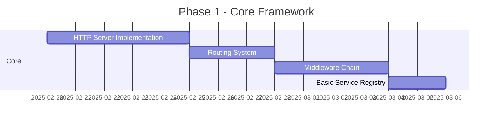
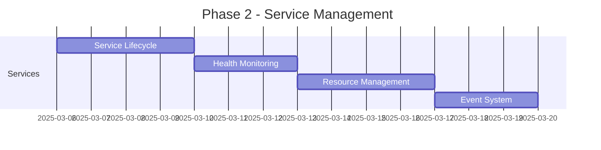
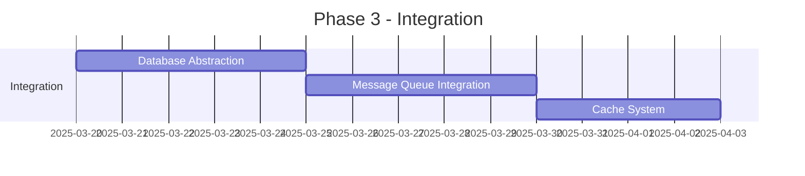
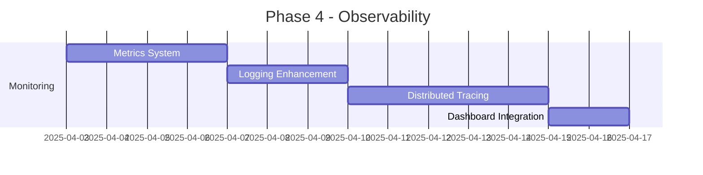
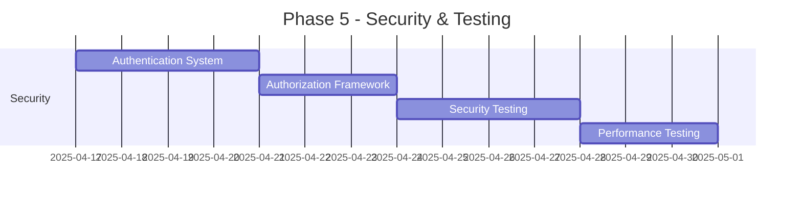
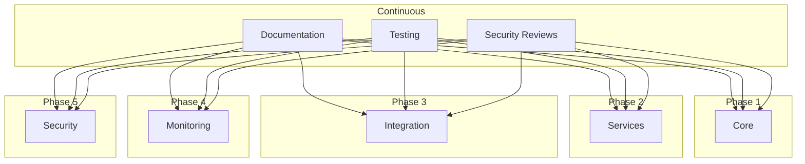

# Development Phases

## Phase 1: Core Framework (2 weeks)

### Deliverables
1. **HTTP Server**
   - Async request handling
   - Route registration
   - Basic middleware support
   - Request/Response objects

2. **Service Registry**
   - Service registration
   - Basic health checks
   - Service discovery

3. **Middleware System**
   - Middleware chain
   - Error handling
   - Basic auth middleware
   - Logging middleware

## Phase 2: Service Management (2 weeks)

### Deliverables
1. **Service Lifecycle**
   - Startup/shutdown
   - State management
   - Dependency handling

2. **Health System**
   - Health checks
   - Status reporting
   - Auto-recovery

3. **Event System**
   - Event bus
   - Pub/sub system
   - Message routing

## Phase 3: Database & Messaging (2 weeks)

### Deliverables
1. **Database**
   - Connection pooling
   - Query building
   - Transaction management

2. **Messaging**
   - Queue abstraction
   - Message handling
   - Retry logic

3. **Caching**
   - Cache interface
   - Distribution
   - Invalidation

## Phase 4: Monitoring & Tracing (2 weeks)

### Deliverables
1. **Metrics**
   - Metric collection
   - Performance monitoring
   - Resource tracking

2. **Logging**
   - Structured logging
   - Log aggregation
   - Error tracking

3. **Tracing**
   - Request tracing
   - Service mapping
   - Performance analysis

## Phase 5: Security & Testing (2 weeks)

### Deliverables
1. **Security**
   - Authentication
   - Authorization
   - Rate limiting
   - Input validation

2. **Testing**
   - Unit tests
   - Integration tests
   - Performance tests
   - Security audits

## Parallel Development

## Timeline Overview

Total Development Time: 10 weeks
- Phase 1: Weeks 1-2
- Phase 2: Weeks 3-4
- Phase 3: Weeks 5-6
- Phase 4: Weeks 7-8
- Phase 5: Weeks 9-10

Each phase includes:
- Implementation
- Testing
- Documentation
- Review
- Integration testing
