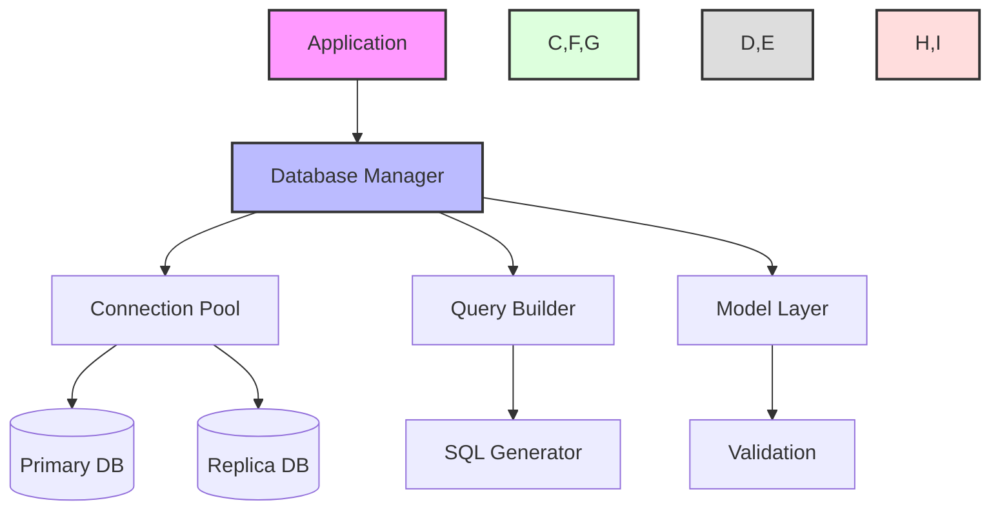
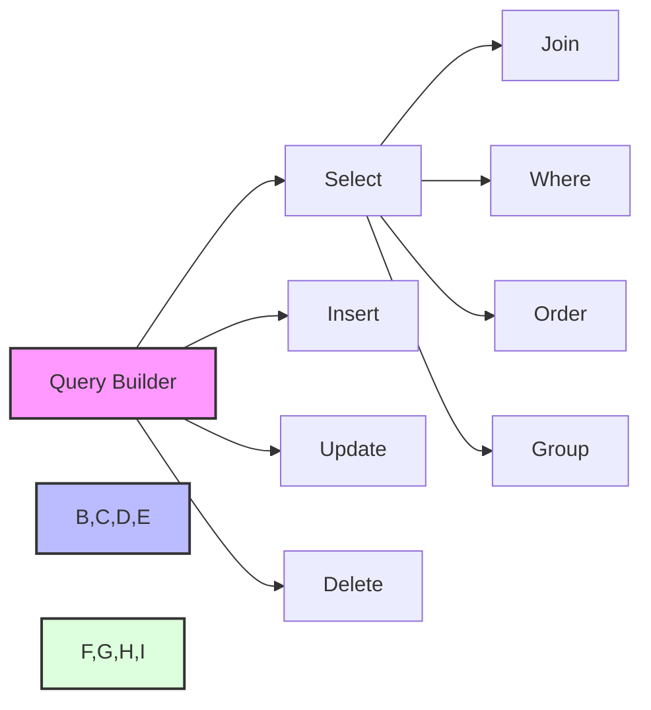
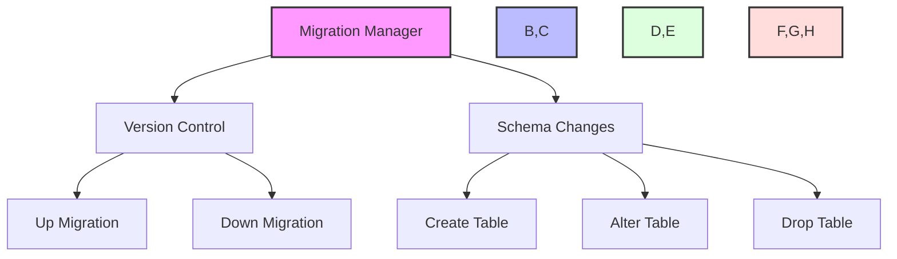
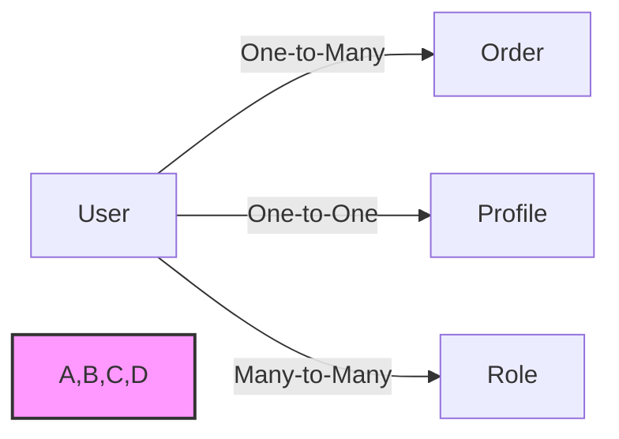
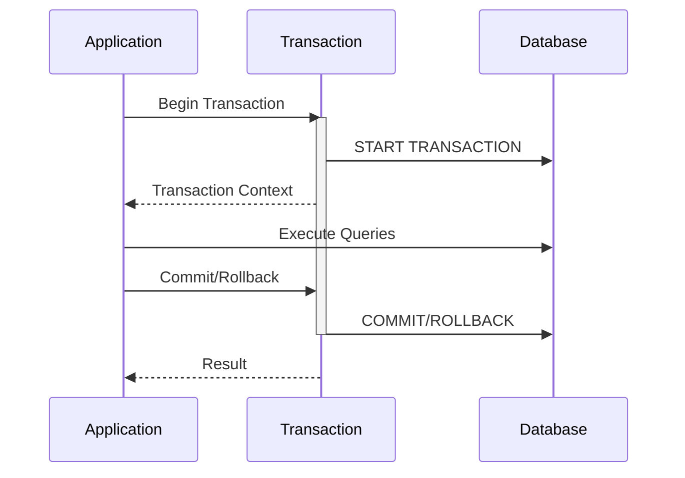
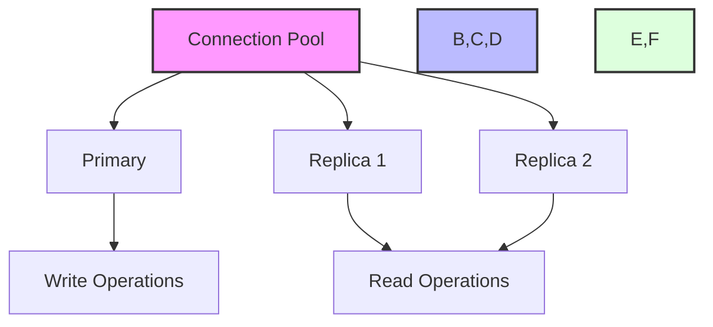

# Database Guide

This guide covers database operations in the Zephyr Framework.

## Database Architecture



## Models

Define your data models with validation:

```python
from zephyr.db import Model, Field
from zephyr.validators import Length, Email

class User(Model):
    id: int = Field(primary_key=True)
    username: str = Field(
        unique=True,
        validators=[Length(min=3, max=50)]
    )
    email: str = Field(
        unique=True,
        validators=[Email()]
    )
    is_active: bool = Field(default=True)

    class Config:
        table_name = "users"
```

## Query Builder



Example usage:

```python
# Select query
users = await db.query(User).where(
    User.is_active == True
).order_by(
    User.username.asc()
).limit(10).all()

# Join query
results = await db.query(Order).join(
    User, Order.user_id == User.id
).where(
    User.is_active == True
).select(
    Order, User.username
).all()
```

## Migrations



Example migration:

```python
from zephyr.db import Migration

class CreateUsersTable(Migration):
    async def up(self):
        await self.create_table("users", [
            ("id", "serial", "primary key"),
            ("username", "varchar(50)", "unique not null"),
            ("email", "varchar(255)", "unique not null"),
            ("created_at", "timestamp", "default current_timestamp")
        ])

    async def down(self):
        await self.drop_table("users")
```

## Relationships



Define relationships:

```python
class User(Model):
    id: int = Field(primary_key=True)
    username: str = Field(unique=True)
    
    # Relationships
    profile = Relationship("Profile", back_populates="user")
    orders = Relationship("Order", back_populates="user")
    roles = Relationship(
        "Role",
        secondary="user_roles",
        back_populates="users"
    )

class Order(Model):
    id: int = Field(primary_key=True)
    user_id: int = Field(foreign_key="users.id")
    amount: float = Field()
    
    # Relationship
    user = Relationship("User", back_populates="orders")
```

## Transactions



Example usage:

```python
async def create_order(user_id: int, items: List[dict]):
    async with db.transaction():
        # Create order
        order = await Order.create(user_id=user_id)
        
        # Create order items
        for item in items:
            await OrderItem.create(
                order_id=order.id,
                **item
            )
            
        # Update inventory
        for item in items:
            product = await Product.get(item["product_id"])
            product.stock -= item["quantity"]
            await product.save()
            
        return order
```

## Connection Management



Configure database connections:

```python
app.config.database = {
    "primary": {
        "url": "postgresql://localhost/myapp",
        "pool_size": 10
    },
    "replicas": [{
        "url": "postgresql://replica1/myapp",
        "pool_size": 5
    }, {
        "url": "postgresql://replica2/myapp",
        "pool_size": 5
    }]
}
```
