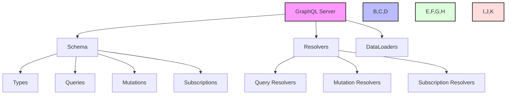
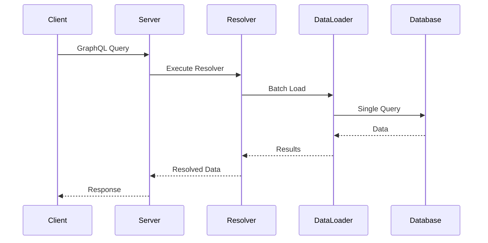
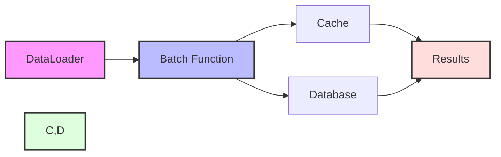
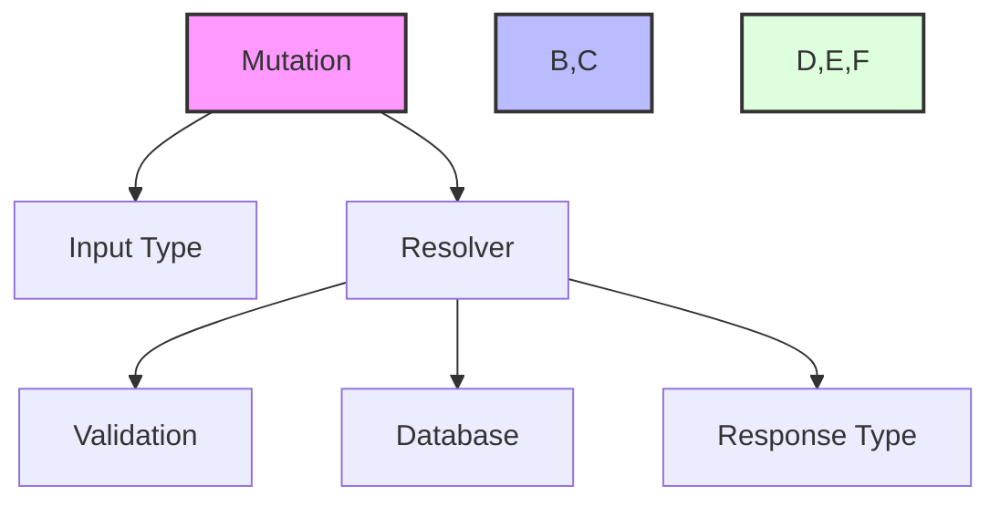
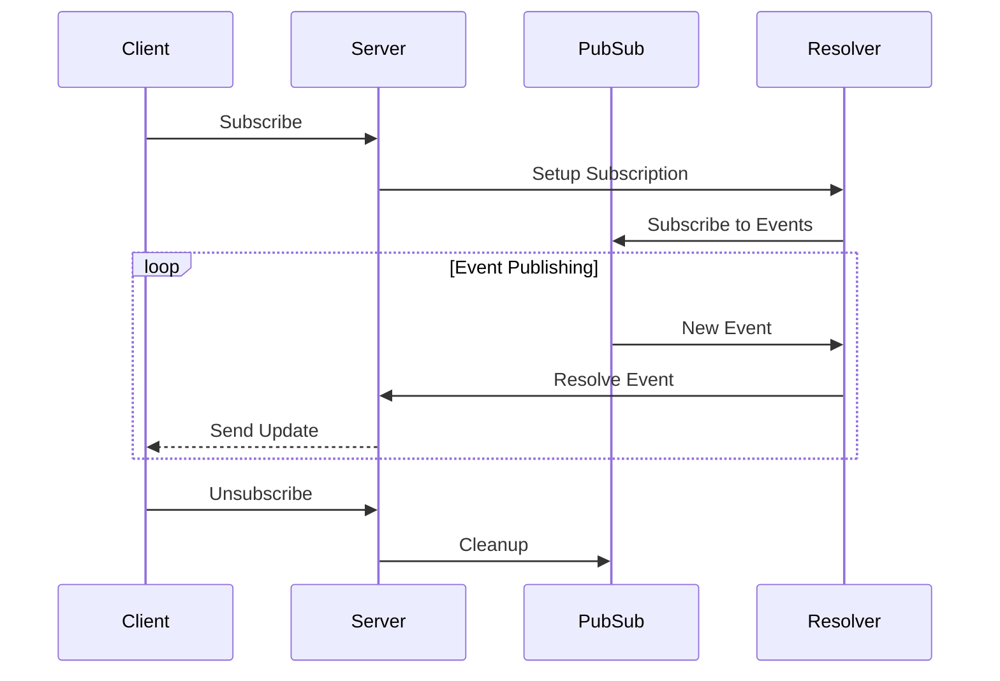
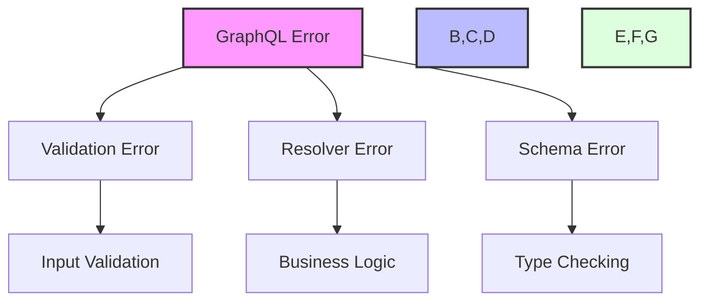
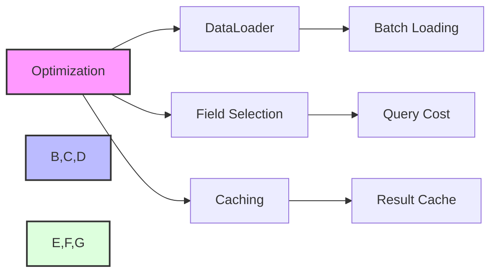

# GraphQL Guide

This guide covers GraphQL implementation in the Zephyr Framework.

## GraphQL Architecture



## Schema Definition

```python
from zephyr.graphql import Schema, ObjectType, Field

class User(ObjectType):
    id: int = Field()
    username: str = Field()
    email: str = Field()
    posts: List["Post"] = Field()

class Post(ObjectType):
    id: int = Field()
    title: str = Field()
    content: str = Field()
    author: User = Field()

class Query(ObjectType):
    user = Field(User, id=int)
    posts = Field(List[Post])

    async def resolve_user(self, id: int):
        return await User.get(id)

    async def resolve_posts(self):
        return await Post.all()

schema = Schema(query=Query)
```

## Query Resolution Flow



## DataLoader Implementation



Example implementation:

```python
from zephyr.graphql import DataLoader

class UserLoader(DataLoader):
    async def batch_load(self, ids: List[int]) -> List[User]:
        users = await User.filter(id__in=ids)
        return [users.get(id) for id in ids]

user_loader = UserLoader()

class Post(ObjectType):
    author = Field(User)
    
    async def resolve_author(self, info):
        return await user_loader.load(self.author_id)
```

## Mutations



Example:

```python
class CreateUserInput(InputType):
    username: str = Field()
    email: str = Field()
    password: str = Field()

class Mutation(ObjectType):
    create_user = Field(
        User,
        input=CreateUserInput
    )
    
    async def resolve_create_user(
        self,
        input: CreateUserInput
    ) -> User:
        return await User.create(**input.dict())

schema = Schema(
    query=Query,
    mutation=Mutation
)
```

## Subscriptions



Implementation:

```python
from zephyr.graphql import Subscription, PubSub

pubsub = PubSub()

class Subscription(ObjectType):
    user_created = Field(User)
    
    async def subscribe_user_created(self, info):
        return await pubsub.subscribe("USER_CREATED")
        
    async def resolve_user_created(self, info, user: User):
        return user

# In mutation
async def resolve_create_user(self, input):
    user = await User.create(**input.dict())
    await pubsub.publish("USER_CREATED", user)
    return user
```

## Error Handling



## Performance Optimization



## Client Usage

```typescript
// Using GraphQL Client
const client = new GraphQLClient('http://localhost:8000/graphql');

// Query
const { user } = await client.query(`
    query GetUser($id: Int!) {
        user(id: $id) {
            id
            username
            posts {
                id
                title
            }
        }
    }
`, { id: 1 });

// Mutation
const { createUser } = await client.mutate(`
    mutation CreateUser($input: CreateUserInput!) {
        createUser(input: $input) {
            id
            username
        }
    }
`, {
    input: {
        username: "john",
        email: "john@example.com"
    }
});

// Subscription
const subscription = client.subscribe(`
    subscription OnUserCreated {
        userCreated {
            id
            username
        }
    }
`);

subscription.subscribe({
    next: ({ userCreated }) => {
        console.log('New user:', userCreated);
    }
});
```
