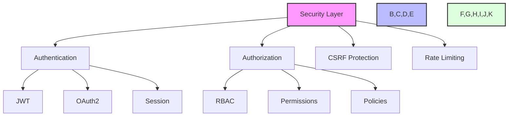
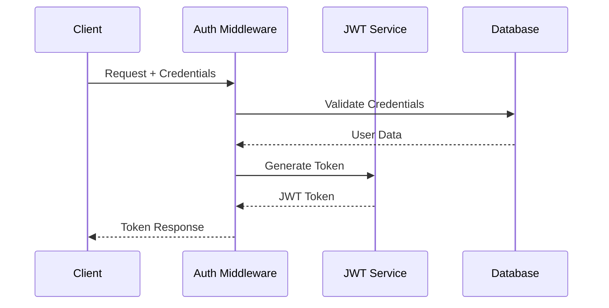
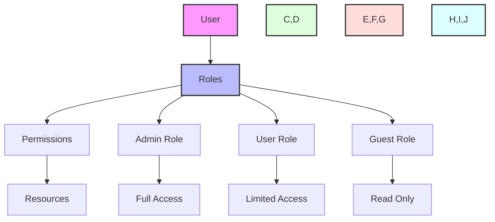
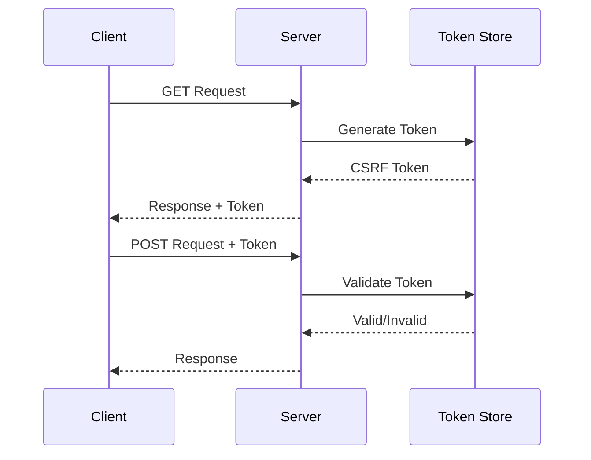
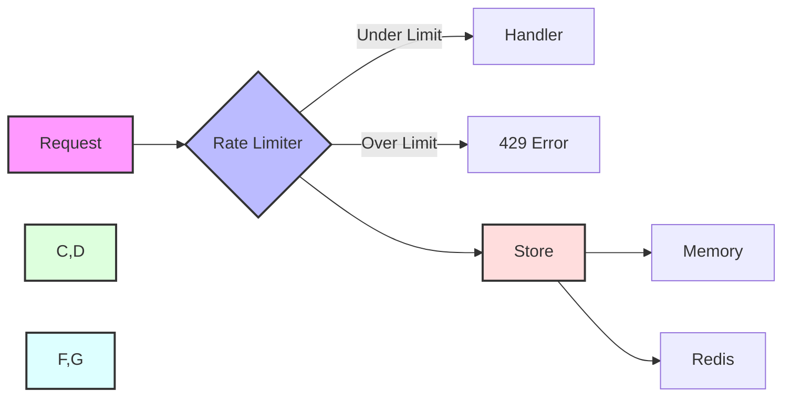
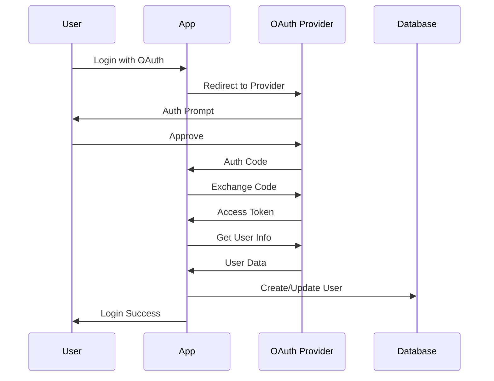
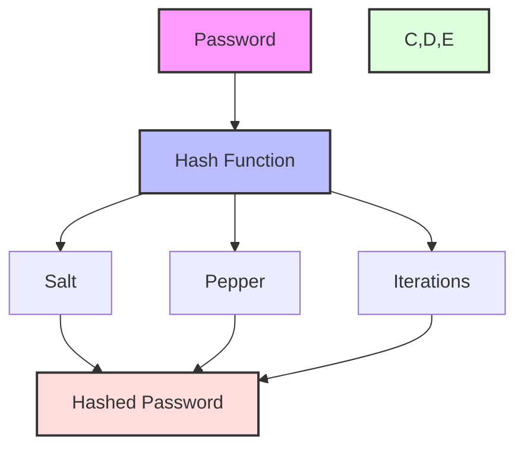

# Security Guide

This guide covers security features in the Zephyr Framework.

## Security Architecture



## Authentication Flow



## JWT Implementation

```python
from zephyr.security import JWT, JWTConfig

jwt = JWT(JWTConfig(
    secret_key="your-secret-key",
    algorithm="HS256",
    access_token_expire=30,  # minutes
    refresh_token_expire=7,  # days
))

@app.route("/login", methods=["POST"])
async def login(credentials: LoginCredentials):
    user = await authenticate_user(credentials)
    tokens = await jwt.create_tokens(user.id)
    return {
        "access_token": tokens.access_token,
        "refresh_token": tokens.refresh_token
    }
```

## Role-Based Access Control



## CSRF Protection



## Rate Limiting



## Security Headers

```python
from zephyr.security import SecurityHeaders

app.use_middleware(SecurityHeaders, {
    "X-Frame-Options": "DENY",
    "X-Content-Type-Options": "nosniff",
    "X-XSS-Protection": "1; mode=block",
    "Strict-Transport-Security": "max-age=31536000; includeSubDomains",
    "Content-Security-Policy": "default-src 'self'"
})
```

## OAuth2 Integration



## Password Security



Example implementation:

```python
from zephyr.security import PasswordHasher

hasher = PasswordHasher()

# Hash password
hashed = await hasher.hash("user_password")

# Verify password
is_valid = await hasher.verify("user_password", hashed)
```

## Security Best Practices

1. **Authentication**:
   ```mermaid
   graph TD
       A[Authentication] --> B[Strong Passwords]
       A --> C[MFA Support]
       A --> D[Session Management]
       A --> E[Account Recovery]
       style A fill:#f9f,stroke:#333,stroke-width:2px
       style B,C,D,E fill:#bbf,stroke:#333,stroke-width:2px
   ```

2. **Data Protection**:
   ```mermaid
   graph TD
       A[Data Protection] --> B[Encryption at Rest]
       A --> C[TLS in Transit]
       A --> D[Key Management]
       A --> E[Data Masking]
       style A fill:#f9f,stroke:#333,stroke-width:2px
       style B,C,D,E fill:#bbf,stroke:#333,stroke-width:2px
   ```

3. **Access Control**:
   ```mermaid
   graph TD
       A[Access Control] --> B[Principle of Least Privilege]
       A --> C[Role-Based Access]
       A --> D[Resource-Based Access]
       A --> E[API Security]
       style A fill:#f9f,stroke:#333,stroke-width:2px
       style B,C,D,E fill:#bbf,stroke:#333,stroke-width:2px
   ```
