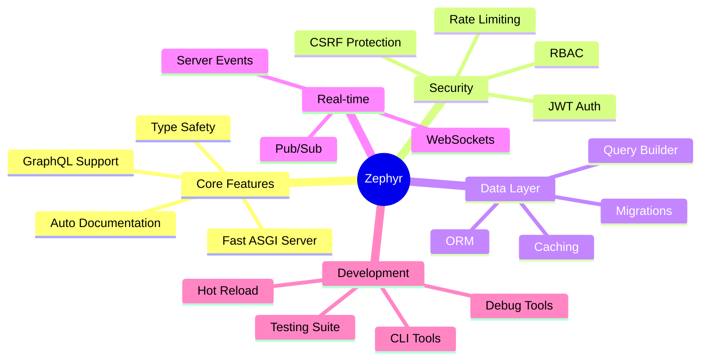
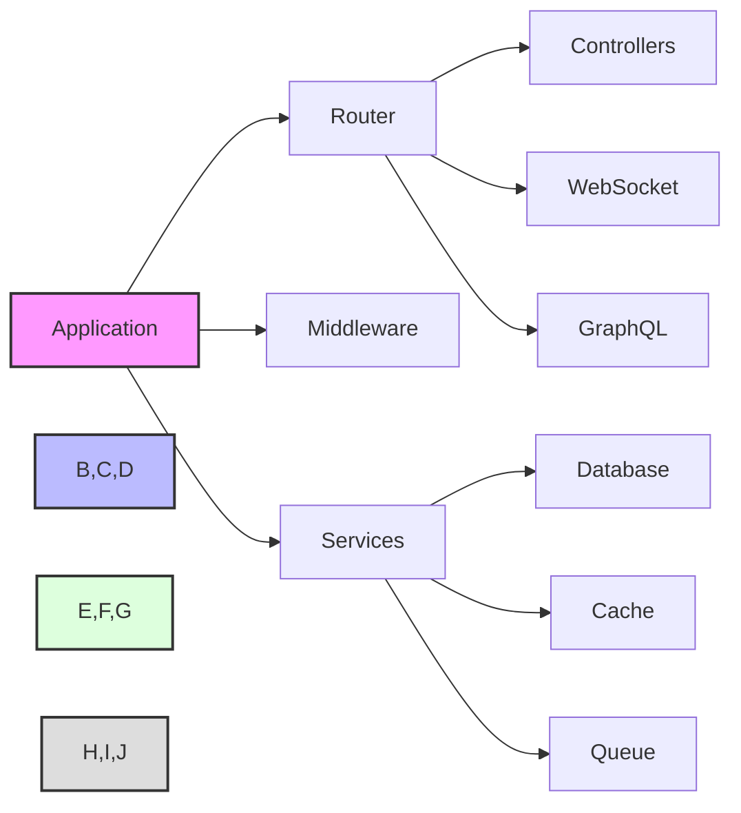

# Zephyr Framework Documentation

Welcome to the Zephyr Framework documentation! This comprehensive guide will help you understand and use the framework effectively.

## Framework Overview

Zephyr is a modern, high-performance Python web framework designed for building scalable applications. It combines the best features of FastAPI, Django, and other modern frameworks while adding enterprise-grade capabilities.

### Key Features

## Request Lifecycle

Understanding how Zephyr handles requests is crucial for building efficient applications.

## Component Architecture

## Quick Navigation

- [Getting Started](guides/getting_started.md)
- [Core Concepts](guides/core_concepts.md)
- [Security](guides/security.md)
- [Database](guides/database.md)
- [WebSockets](guides/websockets.md)
- [GraphQL](guides/graphql.md)
- [Testing](guides/testing.md)
- [Deployment](guides/deployment.md)
