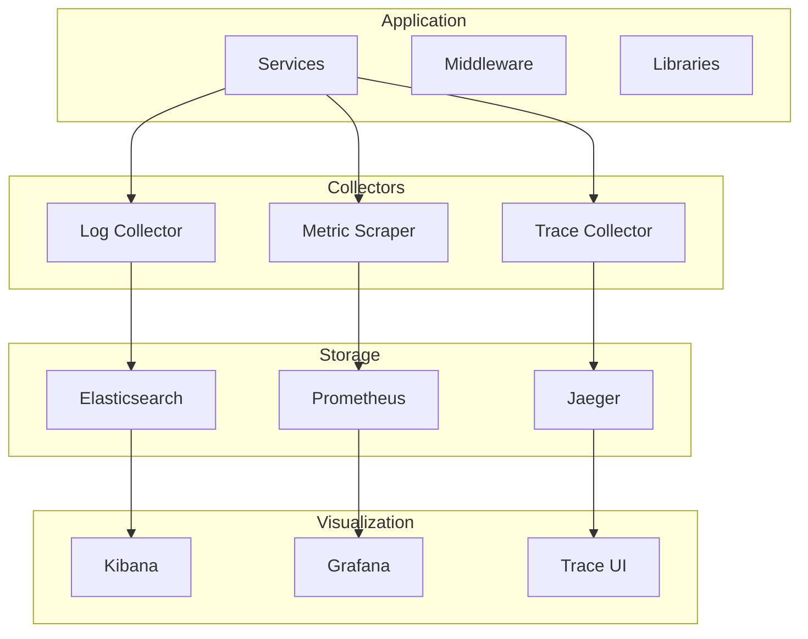
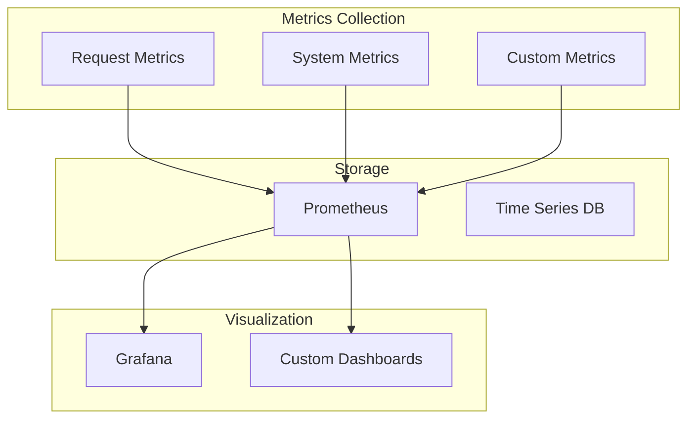
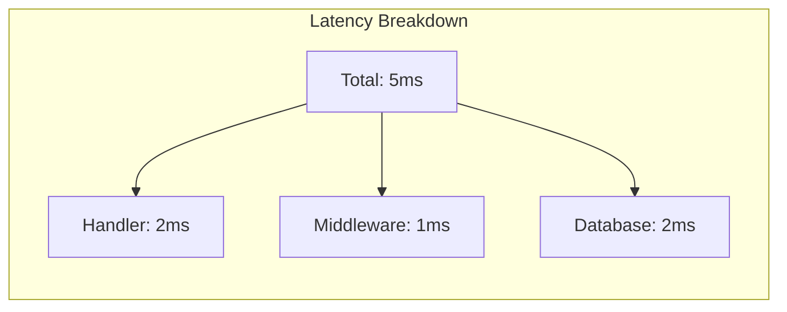
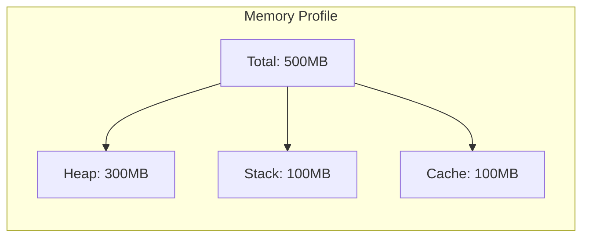
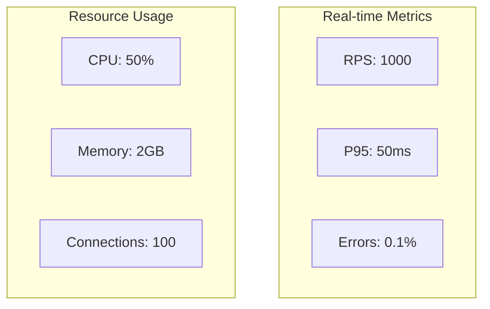
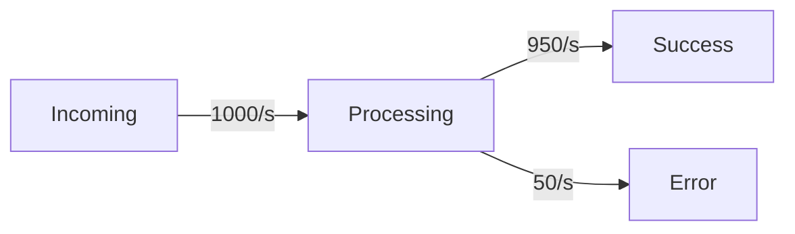

# Monitoring Setup Guide

## Quick Start

```python
# monitoring_config.py
MONITORING_CONFIG = {
    'logging': {
        'level': 'INFO',
        'format': 'structured',
        'outputs': ['console', 'file'],
        'correlation': True
    },
    'metrics': {
        'collectors': ['prometheus'],
        'interval': 10,
        'exporters': ['http']
    },
    'tracing': {
        'enabled': True,
        'sampler': 0.1,
        'exporter': 'jaeger'
    }
}

# service.py
@service(monitoring=MONITORING_CONFIG)
class MonitoredService:
    async def operation(self):
        # Automatically gets logging, metrics, and tracing
        pass
```

## Monitoring Components



## Integration Examples

### Prometheus Integration
```python
@service
class MetricsExample:
    def __init__(self):
        self.metrics = PrometheusMetrics()
        self.counter = self.metrics.counter(
            'requests_total',
            'Total requests processed'
        )
        self.histogram = self.metrics.histogram(
            'response_time_seconds',
            'Response time in seconds'
        )
```

### ELK Stack Integration
```python
@service
class LoggingExample:
    def __init__(self):
        self.logger = ElasticLogger(
            index='service-logs',
            hosts=['elasticsearch:9200']
        )
```

### Jaeger Integration
```python
@service
class TracingExample:
    def __init__(self):
        self.tracer = JaegerTracer(
            service_name='my-service',
            agent_host='jaeger-agent'
        )
```

## Performance Metrics



## Configuration

```yaml
monitoring:
  metrics:
    enabled: true
    collectors:
      - type: request
        path: "/metrics"
        interval: 10
      - type: system
        interval: 30
      - type: custom
        path: "/custom_metrics"
  
  storage:
    type: prometheus
    retention: 15d
    scrape_interval: 10s
  
  visualization:
    type: grafana
    dashboards:
      - name: "Performance"
        panels:
          - title: "Request Latency"
            type: graph
          - title: "Throughput"
            type: gauge
      - name: "Resources"
        panels:
          - title: "CPU Usage"
            type: graph
          - title: "Memory Usage"
            type: graph
```

## Performance Dashboards

### Request Performance


### Resource Usage


## Metric Collection

```python
class PerformanceMetrics:
    def __init__(self):
        self.request_times = Histogram(
            name="request_duration_seconds",
            buckets=[0.1, 0.5, 1.0, 2.0, 5.0]
        )
        self.active_requests = Gauge(
            name="active_requests"
        )
        self.memory_usage = Gauge(
            name="memory_usage_bytes"
        )

    async def collect_metrics(self):
        # Collect system metrics
        memory = psutil.Process().memory_info()
        self.memory_usage.set(memory.rss)

        # Collect request metrics
        async with self.request_times.time():
            result = await self.process_request()
            return result
```

## Alert Configuration

```yaml
alerts:
  - name: high_latency
    condition: request_duration_seconds > 1
    threshold: 10
    duration: 5m
    severity: warning
  
  - name: high_memory
    condition: memory_usage_bytes > 1GB
    threshold: 90
    duration: 10m
    severity: critical
```

## Integration with Middleware

```python
class MonitoringMiddleware:
    def __init__(self, metrics: PerformanceMetrics):
        self.metrics = metrics

    async def should_run(self, request: Request) -> bool:
        # Only monitor non-metrics endpoints
        return not request.path.startswith("/metrics")

    async def process_request(self, request: Request) -> Request:
        if not await self.should_run(request):
            return request

        # Track request
        self.metrics.active_requests.inc()
        request.start_time = time.time()
        return request

    async def process_response(self, response: Response) -> Response:
        if hasattr(response.request, 'start_time'):
            duration = time.time() - response.request.start_time
            self.metrics.request_times.observe(duration)
            self.metrics.active_requests.dec()
        return response
```

## Dashboard Examples

### Performance Dashboard


### Request Flow Dashboard


## Best Practices

1. **Logging**
   - Use structured logging
   - Include context in logs
   - Set appropriate log levels
   - Implement log rotation

2. **Metrics**
   - Define meaningful metrics
   - Use appropriate metric types
   - Set up proper aggregation
   - Configure retention

3. **Tracing**
   - Implement distributed tracing
   - Use proper sampling
   - Add business context
   - Track important operations

4. **Alerting**
   - Define meaningful thresholds
   - Avoid alert fatigue
   - Set up proper routing
   - Include runbooks

5. **Metric Collection**
   - Use histograms for latencies
   - Use counters for events
   - Use gauges for current values

6. **Performance Impact**
   - Minimize metric cardinality
   - Use sampling for high-volume metrics
   - Batch metric updates

7. **Storage**
   - Set appropriate retention
   - Configure storage capacity
   - Plan for scaling

8. **Visualization**
   - Create focused dashboards
   - Use appropriate chart types
   - Set meaningful thresholds
