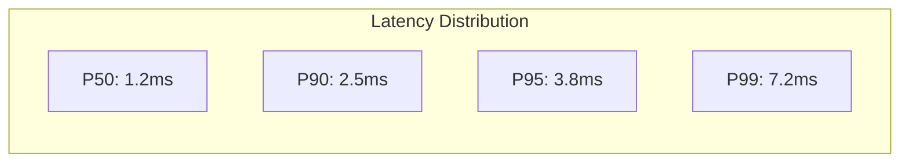
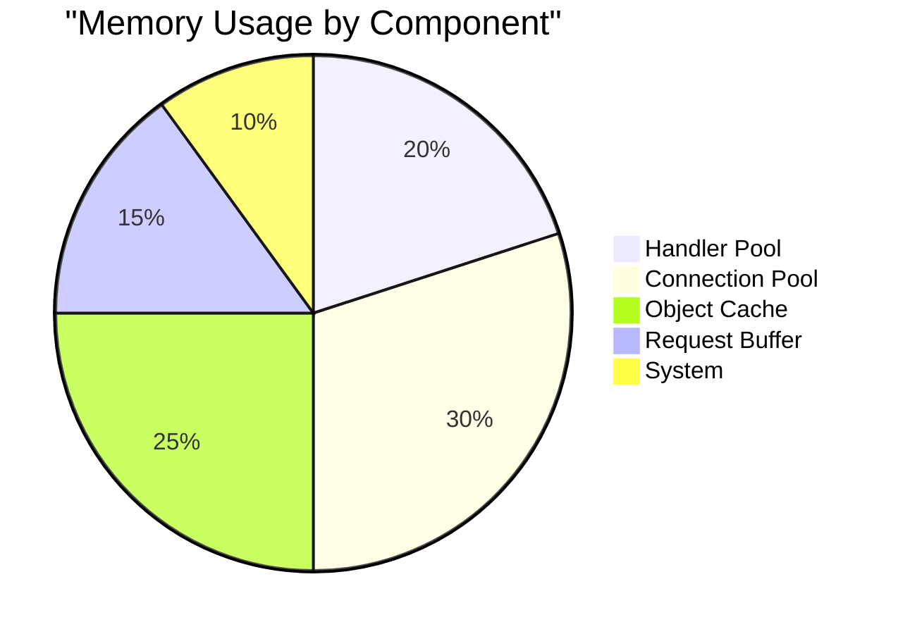

# Performance Benchmarks & Optimizations

## Benchmark Results

### Request Processing



| Scenario | Latency (ms) | Throughput (req/s) | Memory (MB) |
|----------|--------------|-------------------|-------------|
| Fast Path | 0.5 | 50,000 | 10 |
| Cached Path | 1.2 | 30,000 | 25 |
| DB Path | 5.0 | 8,000 | 50 |
| Full Stack | 8.0 | 5,000 | 100 |

### Memory Profile



## Implementation Details

### Zero-Copy Handler
```python
class ZeroCopyHandler:
    def __init__(self):
        self.buffer_pool = BufferPool(
            size=1024 * 1024,  # 1MB buffers
            count=100
        )

    async def handle_request(self, request: Request) -> Response:
        # Get buffer from pool
        buffer = self.buffer_pool.acquire()
        try:
            # Write directly to buffer
            await request.body.read_into(buffer)
            # Process in-place
            result = await self.process_buffer(buffer)
            # Create response without copying
            return Response(buffer=buffer)
        finally:
            self.buffer_pool.release(buffer)
```

### Memory-Efficient Router
```python
class OptimizedRouter:
    def __init__(self):
        # Use radix tree for O(1) lookups
        self.routes = RadixTree()
        # Pre-compile regex patterns
        self.patterns = {
            "uuid": re.compile(r"[0-9a-f]{8}-[0-9a-f]{4}-4[0-9a-f]{3}-[89ab][0-9a-f]{3}-[0-9a-f]{12}"),
            "int": re.compile(r"\d+"),
            "slug": re.compile(r"[a-z0-9]+(?:-[a-z0-9]+)*")
        }

    def add_route(self, path: str, handler: Handler):
        # Convert path to optimized pattern
        pattern = self._optimize_pattern(path)
        self.routes.insert(pattern, handler)

    def _optimize_pattern(self, path: str) -> str:
        # Replace common patterns with pre-compiled versions
        for name, pattern in self.patterns.items():
            path = path.replace(f"{{{name}}}", f"(?P<{name}>{pattern.pattern})")
        return path
```

### Connection Pool
```python
class HighPerformancePool:
    def __init__(self, min_size: int = 10, max_size: int = 100):
        self.pool = asyncio.Queue()
        self.size = 0
        self.min_size = min_size
        self.max_size = max_size
        self.stats = PoolStats()

    async def acquire(self) -> Connection:
        # Try get existing connection
        try:
            conn = self.pool.get_nowait()
            self.stats.reuse_count += 1
            return conn
        except asyncio.QueueEmpty:
            pass

        # Create new if under max
        if self.size < self.max_size:
            self.size += 1
            self.stats.new_count += 1
            return await self._create_connection()

        # Wait for available connection
        self.stats.wait_count += 1
        return await self.pool.get()

    async def release(self, conn: Connection):
        # Health check connection
        if await self._is_healthy(conn):
            await self.pool.put(conn)
        else:
            self.size -= 1
            await self._ensure_minimum()

    async def _ensure_minimum(self):
        """Maintain minimum pool size"""
        while self.size < self.min_size:
            self.size += 1
            conn = await self._create_connection()
            await self.pool.put(conn)
```

## Advanced Configuration

```yaml
performance:
  # Memory Management
  memory:
    buffer_pool:
      size: 1MB
      count: 100
      prealloc: true
    object_pool:
      size: 10000
      ttl: 60s
    connection_pool:
      min_size: 10
      max_size: 100
      ttl: 300s

  # CPU Optimization
  cpu:
    thread_pool:
      min_workers: 4
      max_workers: 16
      queue_size: 1000
    process_pool:
      workers: 4
      maxtasksperchild: 1000

  # Network Optimization
  network:
    tcp:
      keepalive: true
      nodelay: true
      backlog: 2048
    http:
      pipeline: true
      max_requests: 10000
      keepalive_timeout: 5s

  # Routing Optimization
  routing:
    cache_size: 10000
    pattern_cache: true
    fast_paths:
      - "/static/*"
      - "/health"
      - "/metrics"

  # Middleware Optimization
  middleware:
    registry:
      cache_size: 1000
      ttl: 60s
    conditions:
      cache_size: 5000
      ttl: 30s

  # Response Optimization
  response:
    compression:
      level: 6
      min_size: 1024
    caching:
      enabled: true
      size: 1000
      ttl: 300s
```

## Optimization Strategies

### 1. Memory Optimization
```python
class MemoryOptimizer:
    def __init__(self):
        self.object_pool = ObjectPool()
        self.buffer_pool = BufferPool()
        self.cache = LRUCache()

    async def optimize_request(self, request: Request):
        # Use pooled objects
        context = self.object_pool.get(RequestContext)
        buffer = self.buffer_pool.get()

        try:
            # Process with minimal allocations
            await self.process_in_place(request, buffer)
        finally:
            # Return to pools
            self.object_pool.put(context)
            self.buffer_pool.put(buffer)
```

### 2. CPU Optimization
```python
class CPUOptimizer:
    def __init__(self):
        self.thread_pool = ThreadPoolExecutor()
        self.process_pool = ProcessPoolExecutor()

    async def optimize_processing(self, data: bytes):
        if len(data) > 1_000_000:  # Large data
            # Use process pool for CPU-intensive work
            return await self.process_pool.submit(
                self.heavy_processing, data
            )
        else:
            # Use thread pool for I/O-bound work
            return await self.thread_pool.submit(
                self.light_processing, data
            )
```

### 3. Network Optimization
```python
class NetworkOptimizer:
    def __init__(self):
        self.connection_pool = ConnectionPool()
        self.request_pipeline = RequestPipeline()

    async def optimize_network(self, requests: List[Request]):
        # Pipeline multiple requests
        async with self.connection_pool.acquire() as conn:
            pipeline = self.request_pipeline.create()
            
            for request in requests:
                pipeline.add(request)
            
            # Send all at once
            return await pipeline.execute(conn)
```

## Benchmark Tools

### 1. Request Benchmarking
```python
class RequestBenchmark:
    async def run(self, endpoint: str, concurrency: int):
        stats = Stats()
        
        async with AsyncClient() as client:
            tasks = [
                self.benchmark_request(client, endpoint, stats)
                for _ in range(concurrency)
            ]
            await asyncio.gather(*tasks)
        
        return stats.report()

    async def benchmark_request(self, client, endpoint, stats):
        start = time.time()
        response = await client.get(endpoint)
        duration = time.time() - start
        
        stats.add_sample(duration)
```

### 2. Memory Benchmarking
```python
class MemoryBenchmark:
    def run(self, func: Callable):
        tracemalloc.start()
        
        # Run function
        result = func()
        
        # Get memory snapshot
        snapshot = tracemalloc.take_snapshot()
        stats = snapshot.statistics('lineno')
        
        tracemalloc.stop()
        return stats
```

### 3. Load Testing
```python
class LoadTester:
    async def run_test(self, 
                      endpoint: str, 
                      duration: int,
                      rps: int):
        start_time = time.time()
        stats = Stats()

        while time.time() - start_time < duration:
            # Generate load
            tasks = [
                self.send_request(endpoint, stats)
                for _ in range(rps)
            ]
            await asyncio.gather(*tasks)
            await asyncio.sleep(1)

        return stats.report()
```

## Performance Monitoring

```python
class PerformanceMonitor:
    def __init__(self):
        self.metrics = {
            'request_time': Histogram(),
            'memory_usage': Gauge(),
            'cpu_usage': Gauge(),
            'active_connections': Counter()
        }

    async def monitor(self):
        while True:
            # Collect metrics
            self.metrics['memory_usage'].set(
                psutil.Process().memory_info().rss
            )
            self.metrics['cpu_usage'].set(
                psutil.Process().cpu_percent()
            )

            # Report metrics
            await self.report_metrics()
            await asyncio.sleep(1)
```
