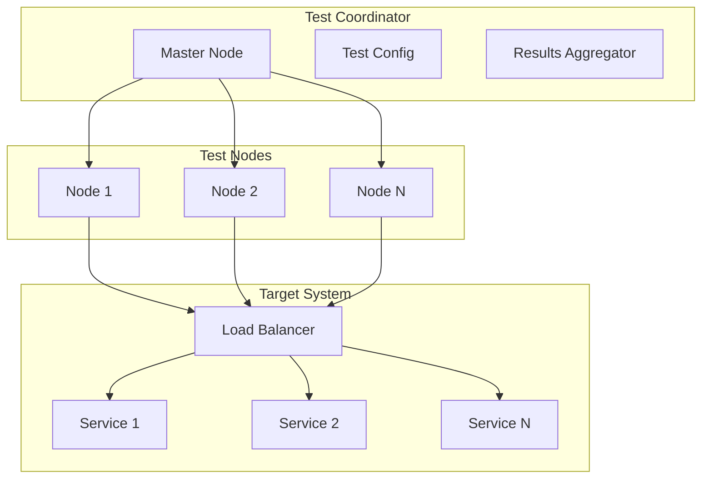

# Distributed Performance Testing

## Architecture



## Implementation

### 1. Test Node
```python
class TestNode:
    def __init__(self, node_id: str):
        self.node_id = node_id
        self.config = None
        self.results = []
        
    async def prepare(self, config: TestConfig):
        self.config = config
        # Initialize resources
        self.client = AsyncClient(
            pool_size=config.connections,
            timeout=config.timeout
        )
        
    async def run_test(self):
        start_time = time.time()
        
        # Generate load
        tasks = [
            self.send_request()
            for _ in range(self.config.requests)
        ]
        
        results = await asyncio.gather(*tasks)
        return TestResults(
            node_id=self.node_id,
            duration=time.time() - start_time,
            results=results
        )
```

### 2. Test Coordinator
```python
class TestCoordinator:
    def __init__(self):
        self.nodes = {}  # node_id -> TestNode
        self.config = None
        
    async def setup_test(self, config: TestConfig):
        self.config = config
        
        # Initialize nodes
        for node_id in config.nodes:
            node = TestNode(node_id)
            await node.prepare(config)
            self.nodes[node_id] = node
            
    async def run_distributed_test(self):
        # Synchronize start
        await self.synchronize_nodes()
        
        # Run tests
        results = await asyncio.gather(*[
            node.run_test()
            for node in self.nodes.values()
        ])
        
        # Aggregate results
        return self.aggregate_results(results)
```

### 3. Results Aggregation
```python
class ResultsAggregator:
    def aggregate(self, results: List[TestResults]) -> TestReport:
        latencies = []
        errors = []
        requests = 0
        
        for result in results:
            latencies.extend(result.latencies)
            errors.extend(result.errors)
            requests += result.total_requests
            
        return TestReport(
            total_requests=requests,
            latencies=self.calculate_percentiles(latencies),
            error_rate=len(errors) / requests,
            errors=self.categorize_errors(errors)
        )
        
    def calculate_percentiles(self, latencies: List[float]):
        return {
            'p50': np.percentile(latencies, 50),
            'p90': np.percentile(latencies, 90),
            'p95': np.percentile(latencies, 95),
            'p99': np.percentile(latencies, 99)
        }
```

## Test Scenarios

### 1. Load Testing
```python
class LoadTest:
    async def run(self, config: LoadTestConfig):
        coordinator = TestCoordinator()
        
        # Ramp up load
        for rps in range(100, 1000, 100):
            config.requests_per_second = rps
            await coordinator.setup_test(config)
            results = await coordinator.run_distributed_test()
            
            if results.error_rate > 0.01:  # 1% error rate
                break
                
        return results
```

### 2. Stress Testing
```python
class StressTest:
    async def run(self, config: StressTestConfig):
        coordinator = TestCoordinator()
        
        # Increase concurrent users
        for users in range(100, 10000, 100):
            config.concurrent_users = users
            await coordinator.setup_test(config)
            results = await coordinator.run_distributed_test()
            
            if results.p99_latency > 1000:  # 1s latency
                break
                
        return results
```

### 3. Endurance Testing
```python
class EnduranceTest:
    async def run(self, config: EnduranceTestConfig):
        coordinator = TestCoordinator()
        start_time = time.time()
        
        while time.time() - start_time < config.duration:
            results = await coordinator.run_distributed_test()
            
            # Monitor system health
            if not await self.check_system_health():
                break
                
            await asyncio.sleep(60)  # Check every minute
            
        return results
```

## Monitoring & Visualization

### 1. Real-time Metrics
```python
class MetricsCollector:
    def __init__(self):
        self.influx = InfluxDBClient()
        
    async def collect_metrics(self, results: TestResults):
        metrics = [
            {
                'measurement': 'request_latency',
                'tags': {
                    'node': result.node_id,
                    'endpoint': result.endpoint
                },
                'fields': {
                    'latency': result.latency,
                    'status': result.status
                }
            }
            for result in results.requests
        ]
        
        await self.influx.write(metrics)
```

### 2. Grafana Dashboard
```python
class Dashboard:
    def create_panels(self):
        return [
            Panel(
                title="Request Latency",
                type="graph",
                targets=[
                    "SELECT mean(latency) FROM request_latency GROUP BY time(1s)"
                ]
            ),
            Panel(
                title="Error Rate",
                type="gauge",
                targets=[
                    "SELECT count(status) FROM request_latency WHERE status >= 400"
                ]
            ),
            Panel(
                title="Throughput",
                type="graph",
                targets=[
                    "SELECT count(latency) FROM request_latency GROUP BY time(1s)"
                ]
            )
        ]
```

## Configuration

```yaml
distributed_testing:
  coordinator:
    host: "test-coordinator.local"
    port: 8000
    
  nodes:
    - id: "node-1"
      host: "test-node-1.local"
      capacity: 1000  # requests/second
    - id: "node-2"
      host: "test-node-2.local"
      capacity: 1000
      
  scenarios:
    load_test:
      duration: 3600  # 1 hour
      ramp_up: 300   # 5 minutes
      initial_rps: 100
      max_rps: 1000
      step: 100
      
    stress_test:
      duration: 1800  # 30 minutes
      initial_users: 100
      max_users: 10000
      step: 100
      
    endurance_test:
      duration: 86400  # 24 hours
      constant_rps: 500
      concurrent_users: 1000
      
  monitoring:
    metrics_interval: 1  # second
    influxdb:
      host: "metrics.local"
      database: "perf_tests"
    grafana:
      host: "dashboard.local"
      port: 3000
```
