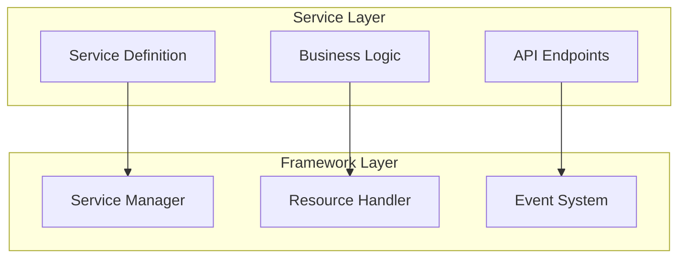
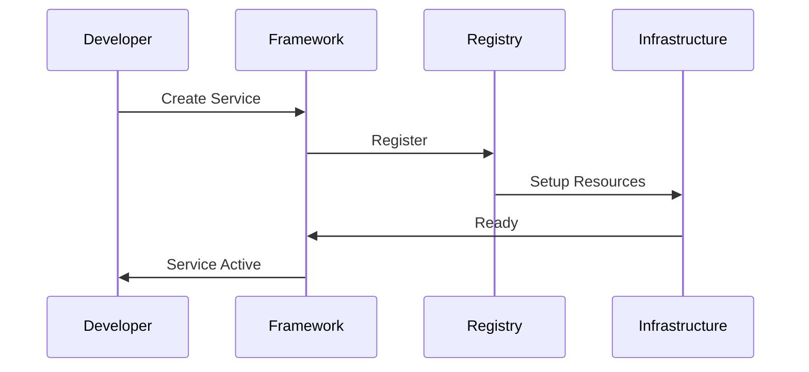
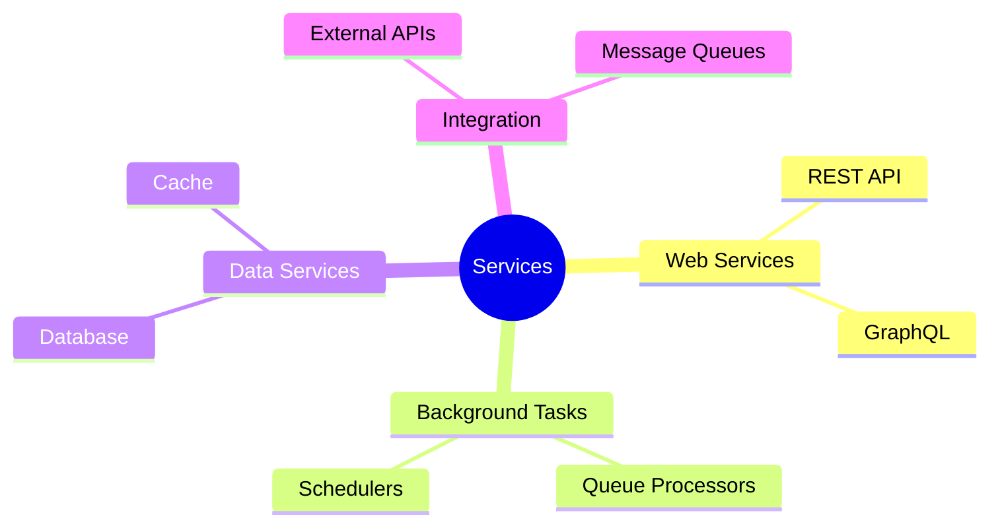
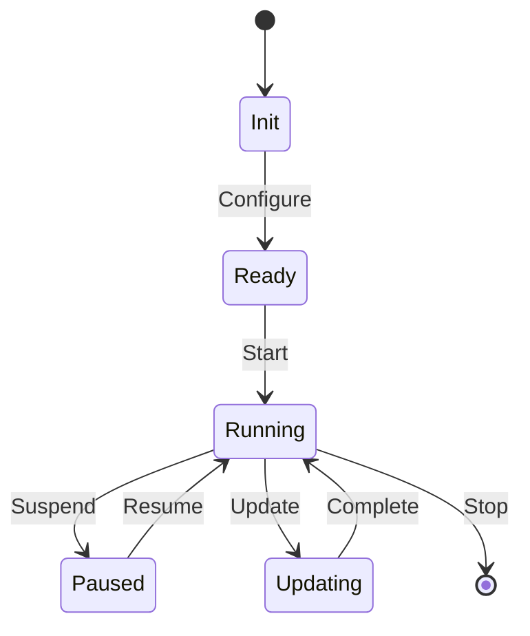
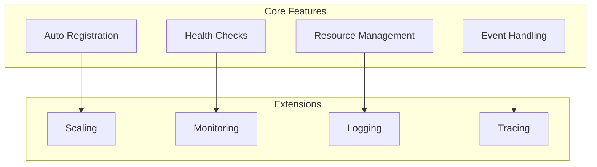
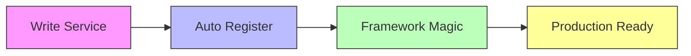

# Creating Services

## Service Architecture



## Service Creation Flow



## Service Types



## Service Lifecycle



## Features
- Automatic registration
- Built-in health checks
- Resource management
- Event handling
- Graceful shutdown

## Best Practices
1. Let the framework handle lifecycle
2. Focus on business logic
3. Use framework events for communication
4. Trust the automatic scaling

## Example Services

### Basic Service
```python
@service
class EmailService:
    async def send_email(self, to: str, subject: str):
        # Framework handles:
        # - Service registration
        # - Resource management
        # - Error handling
        await self.mailer.send(to, subject)
```

### Event-Driven Service
```python
@service
class OrderProcessor:
    @on_event("order.created")
    async def process_order(self, order):
        # Framework provides:
        # - Event subscription
        # - Message handling
        # - Retry logic
        await self.process(order)
```

## Service Features



## Development Flow


