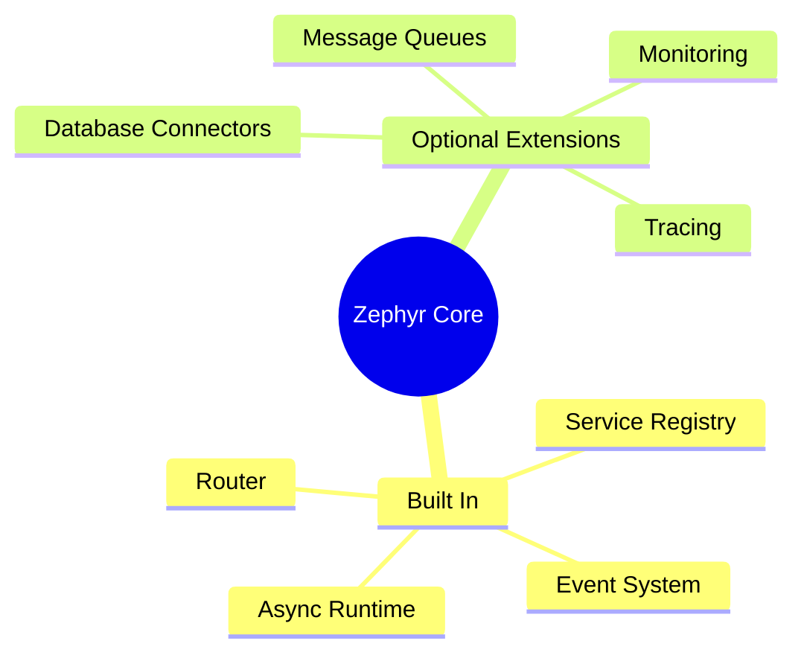
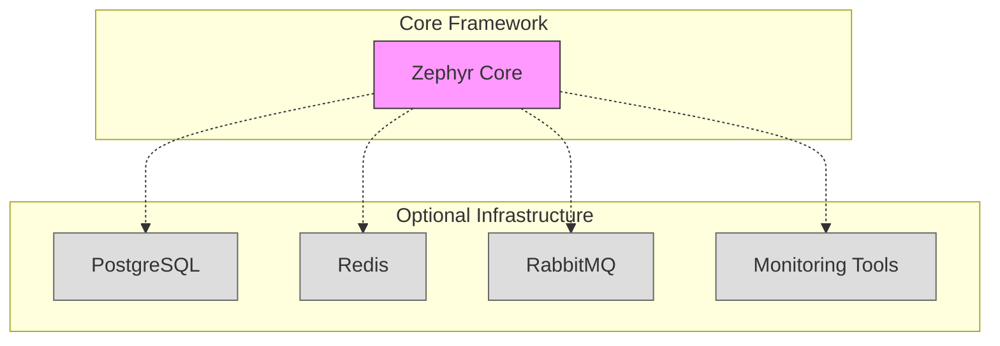

# Framework Dependencies

## Core Framework
Our framework is built from scratch to minimize external dependencies. We only use Python standard library components where possible:

```python
# Standard Library Dependencies
- asyncio        # Async runtime
- typing         # Type hints
- contextlib     # Context managers
- logging        # Basic logging
- socket         # Network operations
- json           # JSON handling
- threading      # Thread management
- queue          # Queue implementations
```

## Minimal External Dependencies



## Optional Integration Support

Only needed if you choose to use these features:

### Database
```python
# Only if using PostgreSQL
asyncpg = "^0.28.0"  # Raw PostgreSQL driver
```

### Message Queue
```python
# Only if using RabbitMQ
aio-pika = "^9.3.0"  # Async RabbitMQ client

# Only if using Redis
redis = "^5.0.0"     # Redis client
```

### Monitoring (Optional)
```python
# Only if using these specific monitoring solutions
prometheus-client = "^0.17.0"  # Prometheus integration
opentelemetry-api = "^1.20.0"  # OpenTelemetry integration
structlog = "^23.1.0"         # Structured logging
```

## Framework Features

Our framework provides its own implementations for:

1. **HTTP Server**
   - Custom async server implementation
   - Route handling
   - Middleware support
   - Request/Response processing

2. **Service Management**
   - Service registration
   - Lifecycle management
   - Health checking
   - Resource management

3. **Event System**
   - Event bus implementation
   - Pub/sub patterns
   - Message routing
   - Event handling

4. **Configuration**
   - Config management
   - Environment handling
   - Service discovery
   - Dynamic updates

## Development Tools

```yaml
development:
  required:
    - Python >= 3.9
    - pip or poetry
  
  recommended:
    - pytest >= 7.4.0  # Testing
    - black >= 23.7.0  # Formatting
    - mypy >= 1.5.0   # Type checking
```

## Infrastructure (Optional)

Only needed based on your deployment choices:



## Note on Dependencies

The framework is designed to be:
- **Self-contained**: Core functionality works without external deps
- **Extensible**: Optional integration with external services
- **Flexible**: Swap implementations without changing core
- **Lightweight**: Minimal dependency footprint

When using external services, appropriate drivers/clients can be added as needed, but the framework core remains independent of these choices.
